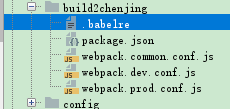

# 环境配置




```text
// 这里可能时间久了.有些插件升级了所以基本上是提供配置思路
//webpack.common.conf.js
const productionConfig = require('./webpack.prod.conf');
const developmentConfig = require('./webpack.dev.conf');
const merge = require('webpack-merge');
const ExtractTextWebpackPlugin = require('extract-text-webpack-plugin');
const HtmlWebpackPlugin = require('html-webpack-plugin');
const path = require('path');
const webpack = require('webpack')
const generateConfig = env => {
    /* module里面的东西太多,我们把他提取出来*/

    const extractLess = new ExtractTextWebpackPlugin({
        //提取出来的css文件名
        //提取出来文件不能自动插入html中.后面会补充解决方法,
        filename: 'css/[name]-bundle-[hash:5].css',
        //指定css提取的范围,默认是false,只提取初始化的,不会提取异步的
        allChunk: false
    });
    const scriptLoader = ['babel-loader'].concat(env === 'production' ? [] : [{
        //babel-loader代码可以提取到.babelrc
        loader: 'eslint-loader',
        options: {
            formatter: require('./eslint-friendly-formatter')
        }
    }]);
    const cssLoaders = [
        {
            loader: 'css-loader',
            options: {
                //minmize:true,
                // modules: true,
                // localIdentName: '[path][name]-[local]-[hash:base64:5]'
                importLoaders: 2,
                sourceMap: env === 'development'
            }
        },
        {
            loader: 'postcss-loader',
            options: {
                ident: 'postcss',
                sourceMap: env === 'development',
                plugins: [
                    //require('autoprefixer')()
                    // 开发环境不需要生产雪碧图
                    require('postcss-cssnext')()
                ].concat(env === 'production'
                    ? require('postcss-sprites')({
                        spritePath: 'dist/assets/imgs/sprites',
                        //处理苹果设备上的高清图
                        retina: true
                    })
                    : []
                )
            }
        },
        {
            loader: 'less-loader',
            options: {
                sourceMap: env === 'development'
            }
        }
    ];
    const styleLoader = env === 'production' ? extractLess.extract({
        /*fallback当页面不知道提取的是用什么loader加载到页面中
           use 继续处理的loader
           要配其他option 可以添加
      */
        fallback: {loader: 'style-loader'},
        use: cssLoaders
    }) : [{loader: 'style-loader'}].concat(cssLoaders);
    const fileLoaders = env === 'development' ? [
        //生产环节是file-loader 开发环境是url-loader 这里要做判断的
        {
            loader: 'file-loader',
            options: {
                name: '[name]-[hash:5].[ext]',
                outputPath: 'assets/imgs/'
            }
        }
    ] : [{
        loader: 'url-loader',
        option: {
            name: '[name][hash:5].[ext]',
            limit: 5000,
            // publicPath: "",
            outputPath: 'assets/imgs/',
            //使用相对路径
            // useRelativePath: true
        }
    }];


    return {
        entry: {
            app: './src/app.js'
        },
        output: {
            path: path.resolve(__dirname, 'dist'),
            publicPath: "/",
            filename: "js/[name]-bundle-[hash:5].js"
        },
        resolve: {
            alias: {
                jquery$: path.resolve(__dirname, 'src/lib/jquery.min.js')
            }
        },
        module: {
            rules: [
                {
                    test: /\.js$/,
                    //eslint检测的文件
                    include: [path.resolve(__dirname, 'src')],
                    //eslint不检测文件
                    exclude: [path.resolve(__dirname, 'src/libs')],
                    use: scriptLoader
                },
                {
                    test: /\.less$/,
                    use: styleLoader
                },
                {
                    test: /\.(png|jpg|jpeg|gif)$/,
                    use: fileLoaders.concat(env === 'production' ? {
                        loader: 'img-loader',
                        options: {
                            pngquant: {
                                quality: 80
                            }
                        }
                    } : [])
                },
                {
                    test: /\.(eot|woff2?|ttf|svg)$/,
                    use: fileLoaders
                }
            ]
        },
        plugins: [
            //默认配置
            extractLess,
            new HtmlWebpackPlugin({
                filename: 'index.html',
                template: './index.html',
                minify: {
                    collapseWhitespace: true
                }
            }),
            new webpack.ProvidePlugin({
                $: 'jquery'
            }),
            // 开发环境
            // 生产环境
            // new CleanWebpackPlugin(['dist']),

        ]
    }

};

module.exports = env => {
    let config = env === "production" ? productionConfig : developmentConfig;
    return merge(generateConfig(env), config)
};

```

```text
// webpack.prod.conf.js
const webpack = require('webpack');
const PurifyCSS = require('purifycss-webpack');
const HtmlWebpackInlineChunkPlugin = require('html-webpack-inline-chunk-plugin');
const CleanWebpackPlugin = require('clean-webpack-plugin');
const glob = require('glob-all');


module.exports = {
    plugins: [
        // CSS.TreeShaking
        new PurifyCSS({
            paths: glob.sync([
                './html', './src/*.js'
            ])
        }),
        // js.TreeShaking
        new webpack.optimize.CommonsChunkPlugin({
            // 把公共js 提取出来,取名为manifse 的chunk文件
            name: 'manifest'
        }),
        // 提前加载公公个代码
        new HtmlWebpackInlineChunkPlugin({
            //提前加载公共代码 插入到html 页面上
            inlineChunks: ['manifest']
        }),
        // 压缩混淆
        new webpack.optimize.UglifyJsPlugin(),
        // 清除目录
        new CleanWebpackPlugin(['dist']),
    ]
}

```

```text
// webpack.dev.conf.js
const webpack=require('webpack');
module.exports = {
    devtool: "cheap-module-source-map",
    devServer: {
        port: 9001,
        historyApiFallback: {
            rewrites: [
                {
                    from: /^\/([a-zA-Z0-9]+\/?)([a-zA-Z0-9]+)/,
                    to: function (context) {
                       return  '/' + context.match[1] + context.match[2] + '.html'
                    }
                }
            ]
        },
        proxy: {
            '/': {
                target: 'https://m.weibo.cn',
                changeOrigin: true,
                logLevel: 'debug',
                pathRewrite: {
                    '^/comments': '/api/comments'
                },
                headers: {
                    'Cookie': '....'
                }
            }
        },
        hot:true,
        hotOnly:true /*不刷新浏览器*/
    },
    plugins: [
        // 热更新相关的
        new webpack.HotModuleReplacementPlugin(),
        new webpack.NamedModulesPlugin()
    ]
}

```

```text
// package.json
add.
  "scripts": {
    "server":"wepback-dev-server --env development --open --config build2chenjing/webpack.common.conf.js",
    "build":"wepback --env production --config build2chenjing/webpack.common.conf.js"
  }
```

