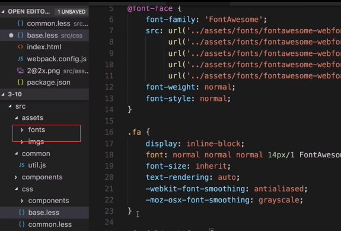

# 字体处理

file-loader url-loader

建议 一般我在使用远程字体的时候,建议把字体下载到本地然后在逐一引入



```text
module.exports={
    entry:{
        'app':'./src/app.js'
    },
    output:{
        path:path.resolve(__dirname,'./dist'),
        filename:'[name].bundle.js',//输出的文件
    },
   modules:{ 
       rules:[
           {},
           {
               loader:'babel-loader',
               options:{
                    presets:['env'],
                    plugins:['lodash']
               }
           },
           {
               test:/\.(png|jpg|jpeg|gif)$/,
               use:[
               /*
                   {
                       loader: 'file-loader',
                       options:{
                           // 背景图配置
                           public    :       "     
                           outputPath:'dist/',
                           useRelativePath:true
                       }
                   },*/
                   //这个时候发现 url-loader 也可以实现file-loader
                   {
                       loader:'url-loader',
                       option:{
                           name:'[name][hash:5]-min.[ext]',
                           limit:5000,
                           publicPath:"",
                           outputPath:'dist/',
                           useRelativePath:true
                       }
                   },
                   {
                       loader:'img-loader',
                       options:{
                           pngquant:{
                               quality:80
                           }
                       }
                   },
                   {
                       test:/\.(eot|woff2?|ttf|svg)$/,
                       use:[
                           {
                               loader:"url-loader",
                               options:{
                                   name:'[name][hash:5]-min.[ext]',
                                   limit:5000,
                                   publicPath:"",
                                   outputPath:'dist/',
                                   useRelativePath:true
                               }
                           }
                       ]
                   }
               ]
           }
       ]
   },
   plugins:[
       new webpack.optimize.uglifyJsPlugin()
   ]
}
```

